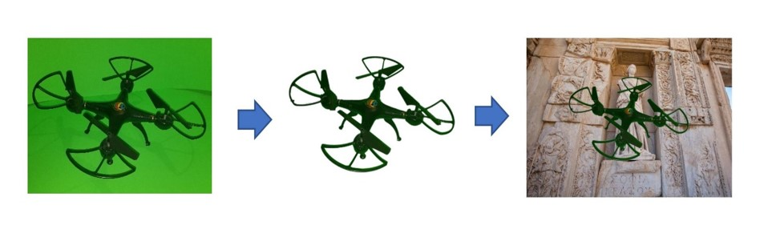

## Fake Images Generator for objekt recognition 

This is a generator for creating fake images, as well as marking them. 
Ready-made description files are created in YOLO format.

# For what?
If you need a large dataset of images of a certain object but there are no already marked-up images in open access, you can create your own dataset using this generator.

Just make a video with the objekt on the greenscreen and remove green background from each frame (in any video editor). Then ise this tool do make iamges and annotations files.

# Input files
  1. Masked image of an object in PNG format
  2. Background image (jpg/png)

# Output files
  1. Fake image. Сombination of two inputs
  2. Text description file in YOLO format. 
  
# Usage

  1.Install numpy, cv2, tqdm, matplotlib and PIL.
  2.Add in folders images of objekts. (different folders - different classes)
  3.Add backgrounds 
  4.Run CreateFakeImages.py
 
 
 # What still needs to be done:
  1. Automatic removal of green background. (it is not easy because it is difficult to make a good and stable chromakey)
  2. Make better color correction.
  3. Make it faster))) 
